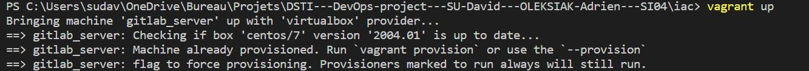
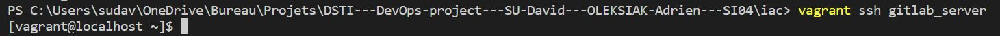

# DSTI---DevOps-project---SU-David---OLEKSIAK-Adrien---SI04

This is the repository for our DevOps project.

## Authors

- David Su <br>
[https://github.com/dvdbx](https://github.com/dvdbx)

- Adrien Oleksiak <br>
[https://github.com/adrienoleksiak](https://github.com/adrienoleksiak)

## Project

### 1. Create a web application

- We used the lab 4 of DevOps to create the app, the front end show a "Hello world" page.

### 2. Apply CI/CD pipeline

We want to implement Continuous Integration and Continuous Delivery.

- For the Continuous Integration We implemented a main.yaml file which allows us to configure github actions. Github action will perform tests at each push or pull request on the main branch <br>


- For the Continuous Delivery... 

### 3. Configure and provision a virtual environment and run your application using the IaC approach

- Vagrant is a tool for building and managing virtual machine environments in a single workflow. We use Vagrant with the Centos7 distribution of Linux. To configure the environment we use the following command :

```
vagrant box add centos/7
```
- We choose the option 3 : virtual box.

- Now we can run our vagrant configuration file using : 
```
vagrant up
```


- Now we can acces to our virtual machine using ssh : 
```
vagrant ssh devops_server
```


- Ansible is an open-source automation tool that automates provisioning, configuration management, application deployment, orchestration.

- In our Vagrantfile, we made the provision with Ansible as follows :

```
# Use Vagrant Ansible provisioner
config.vm.provision "ansible_local" do |ansible|
  # The path to the playbooks entry point
  ansible.playbook = "playbooks/run.yml"
  # Only run the roles with these tags
  ansible.tags = "install"
end
```

### 4. Build Docker image of your application

- Docker is an open source platform that enables developers to build, deploy, run, update and manage containers—standardized.

- We create an image of our application using docker :
```
docker build -t devopsece .
```


- We can run our image using : 
```
docker run -dp 3000:3000 devopsece
```
- We get acces to it at the address `127.0.0.1:3000` : 


- We pushed the image of our application in the dockerhub https://hub.docker.com/, and we configured a .dockerignore file to avoid pushing unnecessary files 

```
docker tag devopsece dvdsu/devopsece
docker push dvdsu/devopsece
```
- We can see it in the dockerhub


### 5. Make container orchestration using Docker Compose

- Docker Compose is an orchestration tool that makes spinning up multi-container distributed applications.

- We add a file docker-compose.yaml for the container orchestration and we use the following command to run it : 
```
docker-compose up
```


And like before, we can acces our application on `127.0.0.1:3000` :


### 6. Make docker orchestration using Kubernetes

- Kubernetes is an open-source software for automating operational tasks of container management and including built-in commands for deploying applications, scaling and management. 

- We implement a new folder call k8s where we set our Manifest yaml files
(deployment.yaml and our services.yaml). Then we use the following command to start minikube and apply our manifest files to our cluster : 

```
minikube start
kubectl apply -f deployment.yaml
kubectl apply -f services.yaml
kubectl get pods
```

- We see the following pods running thanks to the commande kubectl get pods : 


- With the following commands :
```
minikube service userapi
minikube ip
```
- Then we expose our Kubernetes service to the outside :


